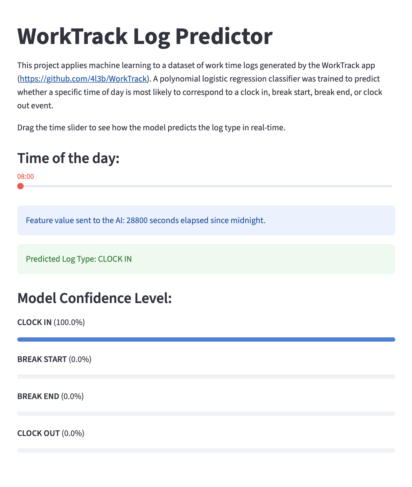

# WorkTrack Log Predictor

A Streamlit application that uses a trained polynomial logistic regression classifier to predict the type of WorkTrack log event based on the time of day.

The model was trained using work time logs generated by the WorkTrack app:
https://github.com/4l3b/WorkTrack.

The Streamlit application performs classification of work log events using three input features: `hour`, `minute`, `second`.

Given a selected time between 08:00 and 19:00, the model predicts the most likely event among:

- Clock In
- Break Start
- Break End
- Clock Out

The application also displays the probability assigned to each class, and it includes an interactive 3D visualization of the model decision space.

The plot represents the regions learned by the classifier: each volume corresponds to a predicted log type, the surfaces represent the decision boundaries between classes, and the marker shows the currently selected time position.

---

### Usage

1. Open the Streamlit application: https://worktrack-predictor.streamlit.app/.
2. Select a time between 08:00 and 19:00 using the slider.
3. The selected time is converted into the three features `hour`, `minute`, and `second`, and the values are passed to the trained model.
4. The predicted event, confidence probabilities, and current position inside the model decision space are displayed.

---

### License

This project is released under the MIT License.

© 2026 by Alessandro Bigolin
